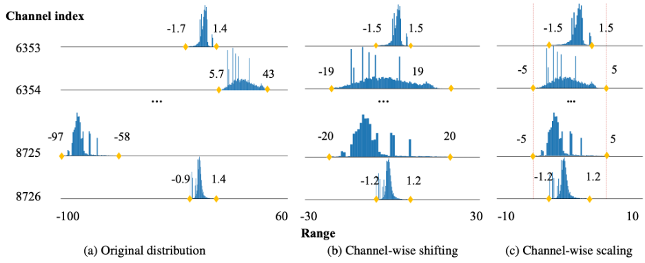

# Outlier Suppression+

Official PyTorch implementation of  <a href="https://arxiv.org/abs/2304.09145">Outlier Suppression+: Accurate quantization of large language models by equivalent and optimal shifting and scaling</a>

## Overview

The Outlier Suppression+ (OS+) effectively suppresses outliers in large language models for better quantization performance without extra inference burden. It first identifies the outlier asymmetric shape across channels and proposes a channel-wise shifting technique with a migration pattern to eliminate it. It then focuses on the outlier concentration phenomenon and proposes to scale down outlier channels toward an elaborate objective. 

<p align="center">
  
</p>

We assess the efficacy of our approach under both standard and fine-grained quantization settings. On standard one, OS+ achieves near-floating-point performance on 8-bit and 6-bit BERT, OPTs, BLOOM, and BLOOMZ. On fine-grained one, OS+ can surpass others by 9.41\% on 4-bit LLaMA with per-token quantization and obtain lossless results on 4-bit OPT with per-group quantization. 

In the following sections, [Support](#support) gives supported models and quantization schemes, [Getting Started](#getting started) introduces the whole procedure to run this project including data preparation, quantization, evaluation and updated model export. [Evaluation](#evaluation) lists configs for each table in the paper for other researchers to reproduce.

## Support

* Models: detailed analysis of outliers can be found in [outlier_analysis.md](outlier_analysis.md)
  - [x] OPTs
  - [x] BLOOM, BLOOMZ
  - [x] LLaMA

* Quantization scheme
  - [x] Standard quantization (per-channel vs per-tensor, symmetric vs asymmetric)
  - [x] Per-token quantization proposed in [ZeroQuant](https://arxiv.org/abs/2206.01861)
  - [x] Per-group quantization proposed in [ZeroQuant-V2](https://arxiv.org/abs/2303.08302)

* Bits
  - [x] 8-bit
  - [x] 6-bit
  - [x] 4-bit

## Getting Started

### Preparation

* Prepare A100 to run the code.

* Install transformers (version 4.30.0) and datasets (version 2.13.1). 

* Prepare pre-trained models such as OPTs, BLOOMs.

* For codes of FP tasks, we adopt the implementation in <a href="https://github.com/EleutherAI/lm-evaluation-harness">lm-evaluation-harness</a>. Thus, download your dataset and update your own data path in lm_eval/dataset directory for later evaluation.

* Considering quantization on zero-shot tasks here, additionally prepare the pile datasets (part of train datasets) for later calibration. Please first download the PILE dataset to ${pile_path}, and run the following code which will randomly select 128 samples for calibration. 

  ```
  dataset_path = ${pile_path}
  calibration_size = 128
  raw_dataset = load_dataset("json", data_files=dataset_path, split="train")
  random_rows = random.sample(range(raw_dataset.num_rows), calibration_size)
  raw_dataset = raw_dataset.select(random_rows)
  raw_dataset.save_to_disk(${pile_cali_path})
  ```

### Quantization

Conduct quantization on specific models and with certain quantization schemes. Here is a simple example for OPT-66B and 8-bit per-tensor symmetric quantization.

```
# opt.sh
model_size=66b
task_name=winogrande
model_path=model_path
q_config=exp/opt/int8.yaml # q_config.yaml path
is_quant=True # True: quantization; False: fp16

export CUDA_VISIBLE_DEVICES=0,1,2,3
python main.py \
    --model opt \
    --model_args pretrained=$model_path \
    --tasks $task_name \
    --batch_size 16 \
    --no_cache \
    --dtype 'float16' \
    --is_quant ${is_quant} \
    --config ${q_config} \
    2>&1 | tee experiment/opt_${model_size}_${task_name}.log
```

Model is assigned with --model and --model_args pretrained args. Quantization config is assigned with q_config. The task is assigned with task_name.
By running the above command, you will get an accuracy of 69.0.

### Export for deployment

As the method only updates weights and biases of the floating-point model, we can easily export a new FP model with weaker outliers, enjoying convenience for further development. Here is an example to export opt-6.7B.

* Obtain the scaling and shifting values by turning on the "is_export" choice in opt.sh file. It will store the calculated values in the ${quant_dir}.

```
# opt.sh
model_size=6.7b
task_name=winogrande
model_path=model_path 
q_config=exp/opt/int8.yaml # q_config.yaml path
is_quant=True # True: quantization; False: fp16
export CUDA_VISIBLE_DEVICES=0
python main.py \
    --model opt \
    --model_args pretrained=$model_path \
    --tasks $task_name \
    --batch_size 16 \
    --no_cache \
    --dtype 'float16' \
    --is_quant ${is_quant} \
    --is_export \
    --config ${q_config} \
    2>&1 | tee experiment/opt_${model_size}_${task_name}.log
```

* Use them to update the original FP model by running export.sh

```
# export.sh
model_size=6.7b   # model size
model_type=opt    # model type
model_path=model_path   # original model path
output_path=output_path # new FP model path
scale_shift_list=exp/opt/scale_shift_list.pth # scaling and shifting values path

export CUDA_VISIBLE_DEVICES=0
python quant_transformer/solver/export.py \
    --model_path $model_path \
    --scale_shift_list $scale_shift_list \
    --model_type $model_type \
    --output_path $output_path
```

## Evaluation

### Introduction of config.yaml

```
quant: 
    a_qconfig: # quantization details for activation
        quantizer: FixedFakeQuantize  # quantizer type
        observer: AvgMinMaxObserver  # calibration methods
        bit: 8 # bit selection
        symmetric: True  # True: symmetric quantization, False: asymmetric one
        ch_axis: -1  # -1: per-layer quantization
    w_qconfig: # quantization details for weight
        quantizer: FixedQuantize # Quantizer type
        observer: MinMaxObserver # calibration methods
        bit: 8 # bit selection
        symmetric: True # True: symmetric quantization, False: asymmetric one
        ch_axis: -1  # 0: per-channel quantization, -1: per-layer one
    calibrate: 128 # calibration size
    calibrate_path: /mnt/lustre/weixiuying.vendor/datasets/nlp_datasets/pile_cali # calibration dataset path, make sure there is _cali in the name
	  except_quantizer: null
    is_remove_padding: True # True: remove [PAD] during calibration
    migrate: True # True: shifting and scaling operations, False: no shifting and scaling operations.
 model:
    max_length: 512 # For PIQA, Winogrande tasks, 512 is enough. For WikiText2, a longer one can improve FP16 results.
```

### Standard quantization with OS+ 

* **8-bit and 6-bit OPTs (Table 2 and Table 9)**

  opt.sh:

    ```
  model_size=66b
  task_name=winogrande
  model_path=model_path
  q_config=exp/opt/int8.yaml # q_config.yaml path
  is_quant=True # True: quantization; False: fp16
  
  export CUDA_VISIBLE_DEVICES=0,1,2,3
  python main.py \
  --model opt \
  --model_args pretrained=$model_path \
  --tasks $task_name \
  --batch_size 16 \
  --no_cache \
  --dtype 'float16' \
  --is_quant ${is_quant} \
  --config ${q_config} \
  2>&1 | tee experiment/opt_${model_size}_${task_name}.log
    ```

  q_config:
  	exp/opt/int8.yaml
      exp/opt/int6.yaml

* **8-bit and 6-bit BLOOM and BLOOMZ (Table 2)**

  bloom.sh:

    ```
  model_size=176b
  task_name=winogrande
  model_path=model_path 
  q_config=exp/bloom/int8.yaml # quantization config path
  is_quant=True # True: quantization; False: fp16
  
  export CUDA_VISIBLE_DEVICES=0,1,2,3,4,5,6,7
  python main.py \
  --model bloom \
  --model_args pretrained=$model_path \
  --tasks ${task_name} \
  --batch_size 12 \
  --no_cache \
  --dtype 'float16' \
  --is_quant ${is_quant} \
  --config ${q_config} \
  2>&1 | tee experiment/bloom_${model_size}_${task_name}.log
    ```

  q_config:
  	exp/bloom/int8.yaml
  	exp/bloom/int6.yaml
  	exp/bloomz/int8.yaml
  	exp/bloomz/int6.yaml

### Fine-grained quantization with OS+

Here, OS+ is combined with fine-grained quantization to validate its wide application and go extremely low bit setting like 4-bit quantization.

* **6-bit and 4-bit LLaMA with per-token quantization (Table 3 and Table 10)**

  Per-token quantization which customizes quantization parameters for individual tokens, can bring better predictions, especially for lower-bit quantization and longer output like WikiText2.

  llama.sh:

    ```
  model_size=7b
  task_name=piqa
  model_path=model_path 
  q_config=exp/llama/int6_token.yaml # quantization config path
  is_quant=True # True: quantization; False: fp16
  
  export CUDA_VISIBLE_DEVICES=0
  python main.py \
  --model llama \
  --model_args pretrained=${model_path} \
  --tasks ${task_name} \ 
  --batch_size 16 \
  --no_cache \
  --dtype 'bfloat16' \
  --is_quant ${is_quant} \ 
  --config ${q_config}"
  2>&1 | tee experiment/llama_${model_size}_${task_name}.log
    ```

  q_config:
  	exp/llama/int6_token_disable.yaml
  	exp/llama/int4_token_disable.yaml
  	exp/llama/int6_token.yaml
  	exp/llama/int4_token.yaml

  

* **4-bit OPT with per-group quantization (Figure 3)**

  opt.sh: 

  ​	the same with the one in standard quantization

  q_config: 

  ​	exp/opt/int4_group.yaml

## Reference

If you find this repo useful for your research, please consider citing the paper:

```
@article{wei2023outlier,
    title={Outlier Suppression+: Accurate quantization of large language models by equivalent and optimal shifting and scaling},
    author={Wei, Xiuying and Zhang, Yunchen and Li, Yuhang and Zhang, Xiangguo and Gong, Ruihao and Guo, Jinyang and Liu, Xianglong},
    journal={arXiv preprint arXiv:2304.09145},
    year={2023}
    }
```