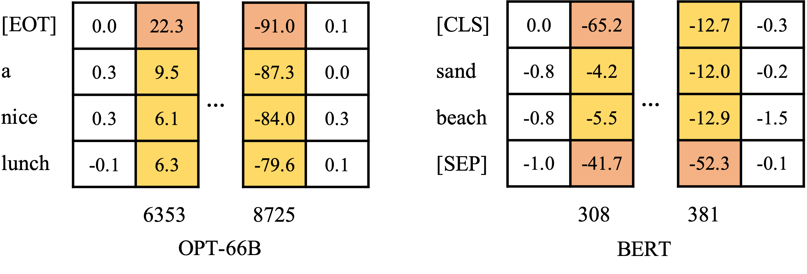

# Outlier Analysis
Quantization, especially post-training quantization (PTQ)  which operates with limited data and GPU resources, has become increasingly challenging for transformer language models (e.g., a 12% accuracy drop in BERT [1] and catastrophic degradation in OPT-175B [2].

  

Outliers on these models show structural phenomena. Firstly, they present in asymmetric shape and concentrate on certain channels. For example, from the colored part in the above figure, it can be seen that almost all the tokens contribute to outliers on certain channels. OPT-66B has hard negative outliers on the 8725-th channel and hard positive ones on the 6353-th channel. For BERT, outliers concentrate on the 308 and 381 channels. Second, a few tokens provide even larger values compared to others such as [SEP] in BERT and [EOT] in OPT (look at the orange part in the figure).

## Channel Aspect
In terms of channels, outliers consistently emerge in certain channels over different inputs. [1, 2] find that these problematic channels are limited and propose some fine-grained methods. [1] employs a per-embedding-group quantization scheme that uses different quantization parameters for distinct channel groups. [2] proposes to utilize FP16 representations for channels holding signals over 6. [3] identifies this feature lying in LayerNorm’s output and migrates the scaling parameter of LayerNorm to subsequent modules with an equivalent transformation to attenuate outliers. [4] propose to calculate scaling values by equalizing ranges between activations and weights. Furthermore, [5] designs the scaling factors that concern the interactive results of troublesome activation and following weights to scale down outlier channels. Also, it notices the asymmetric presentation of outliers and designs a shifting operation. Besides, [6] discovers that normal values are not that important and discards those adjacent to outliers to make room for outliers.

## Token Aspect
In terms of tokens, different tokens exhibit varying degrees of outliers. We find that this phenomenon is obvious in BERT and BLOOM, but less obvious in OPTs. Observing that tokens that denote more aggressive outliers often appear in examples, we conjecture that token divergence might relate to token frequency during the pre-training phase.

To combat this challenge, [2, 7] introduce a novel scheme called per-token quantization that dynamically computes quantization parameters for each token. [5] investigates the clipping impact of outliers and recommends finding an appropriate clipping range in a token-wise manner.

## Related works
[1]. Yelysei Bondarenko, et al, Understanding and overcoming the challenges of efficient transformer quantization. EMNLP 2021.  
[2]. Tim Dettmers, et al, LLM.int8 (): 8-bit matrix mul- tiplication for transformers at scale. NeurIPS 2022.  
[3]. Xiuying Wei, et al. Outlier suppression: Pushing the limit of low-bit transformer language models. NeurIPS 2022.  
[4]. Guangxuan Xiao, Ji Lin, et al.  Smoothquant: Accurate and efficient post-training quantization for large language models. ICML 2023.  
[5]. Xiuying Wei, et al. Outlier Suppression+: Accurate quantization of large language models by equivalent and optimal shifting and scaling. arXiv preprint arXiv:2304.09145.  
[6]. Cong Guo, et al. OliVe: Accelerating Large Language Models via Hardware-friendly Outlier-Victim Pair Quantization. ISCA 2023.  
[7]. Zhewei Yao, et al. ZeroQuant: Efficient and affordable post-training quantization for large-scale transformers. NeurIPS 2022.

